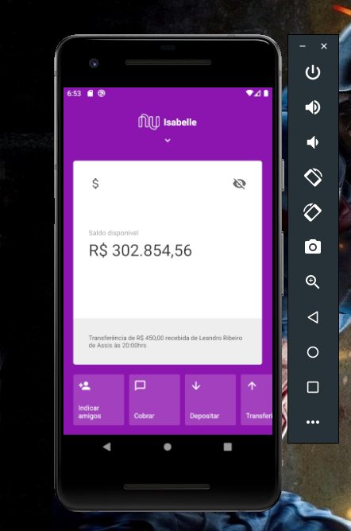
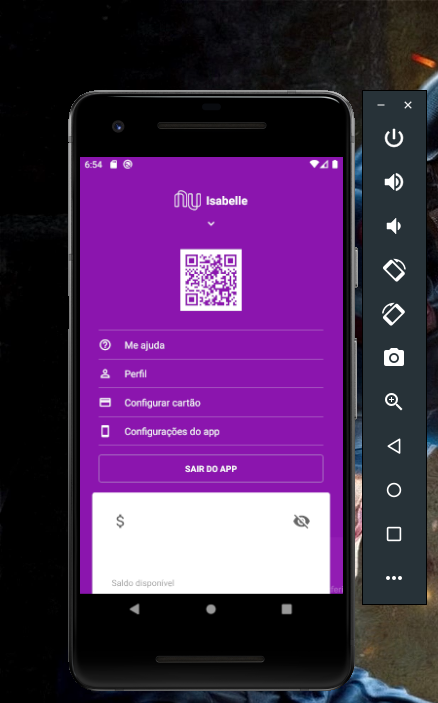

# Clone Interface do Nubank

**React Native Interface App** using **Styled Components**

## Running

Clone the repository.

```bash
git clone https://github.com/ribeiro-le/interface-nbank.git
```

Install the application in your device:

```bash
react-native run-android
```

or

```bash
react-native run-ios
```

Run the following commands to run the server:

```bash
npm start
```

Install Styled Components

```bash
npm install --save styled-components
```

Install Icon

```bash
npm add react-native-vector-icons
```

&

```bash
react native link react-native-vector-icons
```

## Challenge Result





<video width="320" height="240" controls>
  <source src="src/assets/videonbank.mp4" type="video/mp4">

</video>
